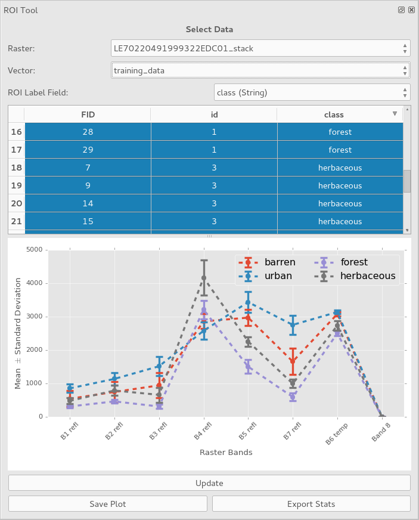

# ROI Explorer
QGIS Plugin for exploring the spectral signatures of ROIs

## TODO
- [ ] Implement zonal stats code
- [ ] Implement plot save dialog
- [ ] Implement stats export dialog
- [ ] Add help
- [ ] Add "ROI Explorer" menu item that includes help and about
- [ ] Enable dynamic UI layout changes from "portrait" to "landscape"
    + Monitor `QDockWidget.dockLocationChanged`
    + If position is left/right, keep portrait
    + If position is top/bottom, switch to landscape
    + Accomplish by switching `QDialog` between vertical and horizontal layouts
    + Blockers:
        * Make layout changes with splitter
        * Ensure certain UI elements can't be squashed (e.g., only plot or table can collapse) 
- [ ] Rebrand plugin
- [ ] Icon
- [ ] Upload to QGIS repository
- [ ] TODO
