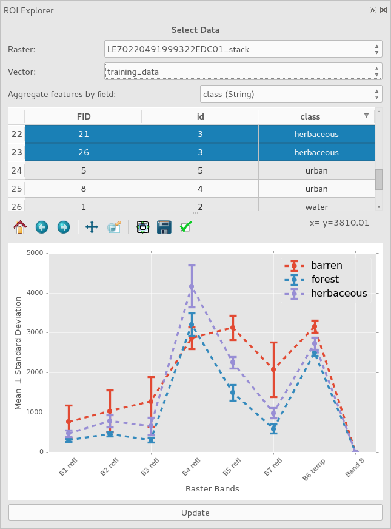

# ROI Explorer
QGIS Plugin for exploring the spectral signatures of regions of interests (ROI). Users may visualize the mean and standard deviations of spectral signatures from a raster image of pixels within selected polygons. Features within the vector dataset will be grouped together if they share the same value within the field indicated by the "Aggregate features by field" drop down box. This plugin is meant to be useful for investigating spectral signatures associated with training data input to a land cover classification. Changing the field specified by the "Aggregate features by field" drop down box allows users to plot within- or between-group spectral signatures. For example, a field named "landcover" may be used to distinguish across spectral signature groups while a label "sample_number" might distinguish different polygons within the same group.

To display the ROI Explorer plugin, right click on any toolbar within QGIS and ensure the "ROI Explorer" item is checked. The plugin's main dialog window is dockable, but may also be utilized undocked from QGIS.

## Example
The following is an example of the statistics of polygons covering several classes of land cover. The vector and raster data used for this example are included in the `data/` folder of this repository.

## TODO
- [x] Upload to QGIS repository
- [ ] Add "ROI Explorer" menu with items that restores/opens plugin window and shows a help/about page
- [ ] Enable dynamic UI layout changes from "portrait" to "landscape"
    + Monitor `QDockWidget.dockLocationChanged`
    + If position is left/right, keep portrait
    + If position is top/bottom, switch to landscape
    + Accomplish by switching `QDialog` between vertical and horizontal layouts
    + Blockers:
        * Make layout changes with splitter
        * Ensure certain UI elements can't be squashed (e.g., only plot or table can collapse)
